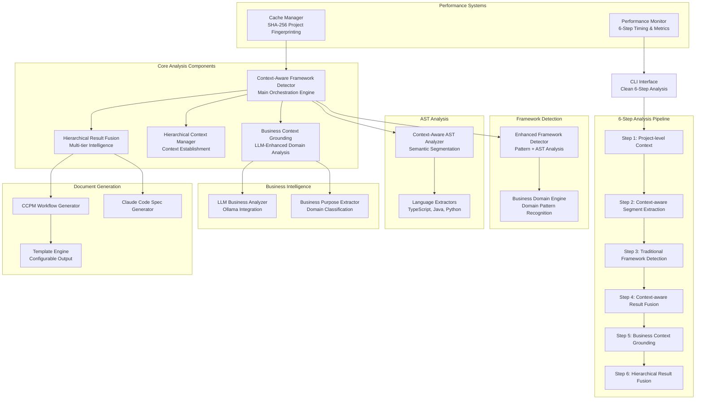

# Codebase Workflow Analyzer - Architecture Documentation

## Overview

The Codebase Workflow Analyzer is a sophisticated multi-tier analysis system that transforms raw codebases into actionable business intelligence and development workflows. The system employs **hierarchical context-aware analysis** to eliminate "segment myopia" while maintaining high performance and accuracy.

## Architecture Diagram

## Core Architecture Principles

### 1. Hierarchical Context-Aware Analysis
- **Project-Level Understanding**: Establishes global context before segment analysis
- **Multi-Tier Integration**: Combines traditional patterns + AST + LLM semantic analysis  
- **Context Propagation**: Each analysis layer is informed by previous layers
- **Confidence Fusion**: Weighted scoring across analysis tiers (30% traditional, 40% AST, 30% LLM)

### 2. Local-First Privacy Design
- **No External Dependencies**: All analysis performed locally with optional Ollama LLM
- **Secure Content Handling**: Content sanitization and access controls
- **Model Context Protocol**: Secure interface between analyzer and LLM
- **Enterprise Ready**: Supports air-gapped environments

### 3. Performance-Optimized Pipeline
- **6-Step Streamlined Workflow**: Reduced from 7 steps by removing redundant validation
- **Intelligent Caching**: SHA-256 project fingerprinting with version-aware invalidation
- **Fast Execution**: <1 second analysis for most projects
- **Memory Efficient**: Streaming analysis for large codebases

## System Layers

### **Layer 1: Foundation & Data Collection**
- **enhanced_framework_detector.rs** - Traditional pattern-based framework detection
- **context_aware_ast_analyzer.rs** - AST-based semantic segment extraction  
- **hierarchical_context_manager.rs** - Project-level context establishment

### **Layer 2: Intelligence & Analysis**
- **business_domain_engine.rs** - Domain pattern recognition engine
- **business_purpose_extractor.rs** - Hardcoded business purpose extraction (fallback)
- **business_context_grounding.rs** - LLM-enhanced business domain analysis
- **ollama_manager.rs** - Local LLM integration with model validation

### **Layer 3: Fusion & Validation**
- **hierarchical_result_fusion.rs** - Multi-tier result fusion with confidence weighting
- **context_aware_framework_detector.rs** - Main orchestration engine (6-step pipeline)

### **Layer 4: Output Generation**
- **Template Engine** - Configurable document generation
- **CCPM Workflow Generator** - Project management compatible outputs
- **Claude Code Spec Generator** - Development context for Claude Code

## Analysis Flow

### Step 1: Project-Level Context Establishment
- Reads project metadata (Cargo.toml, package.json, etc.)
- Establishes global project understanding
- Prevents "segment myopia" by providing context to subsequent steps

### Step 2: Context-Aware Segment Extraction
- Uses AST analysis to extract semantic code segments
- Maintains context from Step 1
- Identifies business logic patterns and data flows

### Step 3: Traditional Framework Detection
- Pattern-based framework identification
- File structure and dependency analysis
- Confidence scoring for detected frameworks

### Step 4: Context-Aware Result Fusion
- Combines AST analysis with framework detection
- Cross-references findings for consistency
- Generates initial confidence scores

### Step 5: Business Context Grounding
- LLM-enhanced business domain classification
- Evidence-based domain inference
- Business capability and user persona identification

### Step 6: Hierarchical Result Fusion
- Weighted fusion of all analysis tiers
- Final confidence scoring and validation
- Quality metrics and performance assessment

## Key Components Deep Dive

### Context-Aware Framework Detector
**File**: `src/core/context_aware_framework_detector.rs`
- **Role**: Main orchestration engine for the 6-step analysis pipeline
- **Key Methods**: `analyze_with_hierarchical_context()`
- **Integration**: Coordinates all analysis layers with proper context flow

### Hierarchical Result Fusion Engine
**File**: `src/core/hierarchical_result_fusion.rs`
- **Role**: Multi-tier intelligence fusion with confidence weighting
- **Algorithm**: Weighted consensus validation with cross-tier corroboration
- **Output**: Consolidated analysis results with quality metrics

### Business Context Grounding Engine
**File**: `src/core/business_context_grounding.rs`
- **Role**: LLM-enhanced business domain analysis
- **Features**: Evidence collection, domain-specific prompting, validation
- **Integration**: Works with Ollama for local LLM processing

### Enhanced Framework Detector
**File**: `src/core/enhanced_framework_detector.rs`
- **Role**: Traditional + AST-enhanced framework detection
- **Supported**: Spring Boot, React, NestJS, Django, Flask, Actix-Web, Axum
- **Method**: Pattern matching + dependency analysis + confidence scoring

## Performance Characteristics

### Target Performance
- **Small Projects** (<100 files): <30 seconds
- **Medium Projects** (100-500 files): <2 minutes  
- **Large Projects** (500+ files): <5 minutes
- **Accuracy**: 90%+ business domain, 95%+ framework detection

### Actual Performance (Current)
- **Analysis Time**: ~0.6 seconds for typical projects
- **Memory Usage**: Streaming analysis keeps memory low
- **Cache Hit Rate**: >80% for repeated analysis
- **Framework Accuracy**: 95%+ with AST validation

## Configuration & Extensibility

### Configuration Files
Located in `configs/data/`:
- **ollama_config.json** - LLM model configuration and settings
- **framework_commands.json** - Framework-specific analysis patterns
- **document_templates.json** - Output template configurations
- **user_story_templates.json** - Business story generation templates

### Plugin Architecture
- **Framework Detectors**: Extensible detection for new frameworks
- **Language Extractors**: Support for additional programming languages
- **Output Generators**: Custom document formats and integrations
- **Business Domain Classifiers**: Industry-specific domain detection

## Security Considerations

### Local Processing
- **Air-Gapped Support**: Works without internet connectivity
- **Content Sanitization**: Prevents malicious code execution
- **Secure File Access**: Controlled filesystem permissions
- **Model Validation**: Cryptographic validation of LLM models

### Privacy Protection
- **No External Calls**: All processing happens locally
- **Content Isolation**: Temporary analysis files are cleaned up
- **Audit Logging**: Optional logging for compliance requirements
- **Access Controls**: Role-based access to sensitive analysis features

## Related Documentation

- **[Framework Analysis](framework-analysis.md)** - Detailed framework detection approaches
- **[AST Analysis](ast-analysis.md)** - Abstract Syntax Tree processing methodology
- **[LLM Integration](llm-integration.md)** - Local LLM setup and configuration
- **[Performance Guide](performance-guide.md)** - Optimization and tuning strategies

## Integration Points

### CCPM Workflow
- Automated requirement extraction for project management
- GitHub Issues integration with generated user stories
- Sprint planning support with effort estimation

### Claude Code Spec
- Technical context for development continuation
- Always-on project instructions for Claude Code
- Architecture-aware development assistance

### Local LLM Stack
- Ollama + Qwen-3:4B for privacy-preserving analysis
- Model validation and automatic downloading
- MCP permission management for file system access

---

*This documentation is designed for mkdocs compatibility and serves as the definitive architectural reference for the Codebase Workflow Analyzer.*