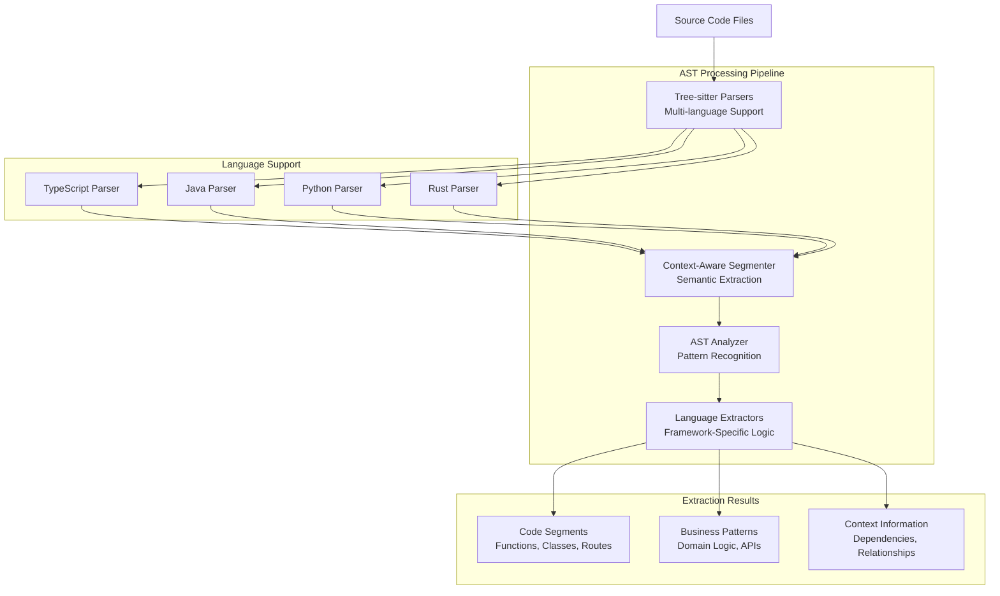

# AST Analysis - Abstract Syntax Tree Processing

## Overview

The Codebase Workflow Analyzer employs sophisticated **Abstract Syntax Tree (AST) analysis** to understand code semantics beyond pattern matching. Using **tree-sitter** for multi-language parsing, the system extracts semantic code segments while maintaining context awareness throughout the analysis pipeline.

## AST Analysis Architecture



## Core Components

### Context-Aware AST Analyzer

**File**: `src/core/context_aware_ast_analyzer.rs`

```rust
pub struct ContextAwareASTAnalyzer {
    parsers: HashMap<Language, Parser>,
    extractors: HashMap<Language, Box<dyn LanguageExtractor>>,
    context_manager: HierarchicalContextManager,
}

pub struct ContextAwareSegmentExtractionResult {
    pub enhanced_segments: Vec<EnhancedSegmentContext>,
    pub global_context: ProjectContext,
    pub extraction_metadata: ExtractionMetadata,
}
```

**Key Capabilities:**
- **Multi-language Parsing**: Unified interface for TypeScript, Java, Python, Rust
- **Context Preservation**: Maintains project-level context during segment extraction
- **Semantic Understanding**: Goes beyond syntax to understand code meaning
- **Relationship Mapping**: Identifies dependencies and interactions between code segments

### Language-Specific Extractors

Each language has specialized extractors that understand framework-specific patterns:

#### **TypeScript Extractor**
**File**: `src/core/extractors/typescript.rs`

**Extracted Patterns:**
- **React Components**: Function and class components, hooks usage
- **API Routes**: Next.js API routes, Express route handlers
- **Business Logic**: Service classes, utility functions
- **Type Definitions**: Interfaces and types that reveal business models

```typescript
// Detected as: API Route Segment
export async function POST(request: Request) {
    const { userId, productId } = await request.json();
    // Business logic: E-commerce order processing
    return processOrder(userId, productId);
}

// Detected as: Business Logic Segment  
interface OrderData {
    userId: string;
    productId: string;
    quantity: number;
    // Domain indicator: E-commerce
}
```

#### **Java Extractor**
**File**: `src/core/extractors/java.rs`

**Extracted Patterns:**
- **Spring Controllers**: `@RestController`, `@RequestMapping` patterns
- **Service Classes**: `@Service`, `@Component` business logic
- **Entity Definitions**: JPA entities and database models
- **Configuration Classes**: `@Configuration` and setup patterns

```java
// Detected as: API Endpoint Segment
@RestController
@RequestMapping("/api/orders")
public class OrderController {
    // Domain indicator: E-commerce order management
    
    @PostMapping
    public ResponseEntity<Order> createOrder(@RequestBody OrderRequest request) {
        // Business pattern: Order processing
        return orderService.createOrder(request);
    }
}
```

#### **Python Extractor**
**File**: `src/core/extractors/python.rs`

**Extracted Patterns:**
- **Flask/Django Routes**: Route decorators and view functions
- **Class Definitions**: Business logic classes and data models
- **Function Definitions**: Business operations and utility functions
- **Import Analysis**: Dependency patterns and framework usage

```python
# Detected as: Route Handler Segment
@app.route('/api/users', methods=['POST'])
def create_user():
    # Business pattern: User management
    user_data = request.get_json()
    return user_service.create_user(user_data)

# Detected as: Data Model Segment
class User(db.Model):
    # Domain indicator: User management system
    id = db.Column(db.Integer, primary_key=True)
    email = db.Column(db.String(120), unique=True)
```

### Segment Types and Classification

#### **Code Segment Types**

```rust
#[derive(Debug, Clone, PartialEq)]
pub enum SegmentType {
    Function,           // Individual function definitions
    Class,             // Class definitions with methods
    Interface,         // Type definitions and interfaces
    Route,            // API endpoint handlers
    Component,        // UI components (React, Vue, etc.)
    Service,          // Business logic services
    Model,            // Data models and entities
    Configuration,    // Configuration and setup code
    Middleware,       // Request/response processing
    Utility,          // Helper functions and utilities
}
```

#### **Business Pattern Recognition**

**API Patterns:**
- REST endpoint patterns (`GET /users`, `POST /orders`)
- GraphQL resolver patterns
- RPC and service call patterns
- Authentication and authorization patterns

**Data Patterns:**
- Entity relationship patterns
- Database migration patterns
- Data validation patterns
- Business rule enforcement patterns

**Integration Patterns:**
- External service calls
- Message queue interactions
- Event handling patterns
- Third-party API integrations

## Context-Aware Segmentation

### Project-Level Context

**Context Establishment:**
1. **Project Metadata**: Package files, configuration files, README analysis
2. **Dependency Analysis**: Framework and library dependencies
3. **Architecture Patterns**: Identified architectural styles and conventions
4. **Domain Indicators**: Business domain hints from project structure

### Hierarchical Context Propagation

```rust
pub struct EnhancedSegmentContext {
    pub segment: CodeSegment,
    pub project_context: ProjectContext,
    pub local_context: LocalSegmentContext,
    pub business_indicators: Vec<BusinessIndicator>,
    pub confidence_metrics: ConfidenceMetrics,
}

pub struct ProjectContext {
    pub framework_type: FrameworkType,
    pub architecture_pattern: String,
    pub business_domain_hints: Vec<String>,
    pub integration_points: Vec<IntegrationPoint>,
}
```

**Context Flow:**
1. **Global Context** → Established once per project
2. **File Context** → Derived from global + file-specific information  
3. **Segment Context** → Combined global + file + segment-specific context
4. **Relationship Context** → Cross-segment dependencies and interactions

## Tree-Sitter Integration

### Multi-Language Parser Configuration

```rust
pub struct ASTAnalyzer {
    typescript_parser: Parser,
    java_parser: Parser,
    python_parser: Parser,
    rust_parser: Parser,
}

impl ASTAnalyzer {
    pub fn parse_file(&mut self, content: &str, language: Language) -> Option<Tree> {
        let parser = match language {
            Language::TypeScript => &mut self.typescript_parser,
            Language::Java => &mut self.java_parser,
            Language::Python => &mut self.python_parser,
            Language::Rust => &mut self.rust_parser,
        };
        
        parser.parse(content, None)
    }
}
```

### AST Traversal and Pattern Matching

**Tree Traversal Strategy:**
- **Depth-First Search**: Complete subtree analysis before moving to siblings
- **Context Preservation**: Parent node context maintained during traversal
- **Pattern Matching**: Framework-specific patterns applied to nodes
- **Relationship Tracking**: Dependencies and references tracked across nodes

### Semantic Analysis Patterns

#### **Function Analysis**
```rust
pub fn analyze_function_node(node: &Node, source: &str, context: &SegmentContext) -> FunctionSegment {
    let name = extract_function_name(node, source);
    let parameters = extract_parameters(node, source);
    let return_type = extract_return_type(node, source);
    let business_indicators = identify_business_patterns(&name, &parameters, context);
    
    FunctionSegment {
        name,
        parameters,
        return_type,
        business_indicators,
        segment_type: classify_function_type(&name, &parameters, context),
    }
}
```

#### **Class Analysis**
```rust
pub fn analyze_class_node(node: &Node, source: &str, context: &SegmentContext) -> ClassSegment {
    let class_name = extract_class_name(node, source);
    let methods = extract_methods(node, source, context);
    let properties = extract_properties(node, source);
    let decorators = extract_decorators(node, source); // Java annotations, Python decorators
    
    ClassSegment {
        name: class_name,
        methods,
        properties,
        decorators,
        business_patterns: identify_class_business_patterns(&class_name, &decorators),
    }
}
```

## Business Logic Extraction

### Domain-Specific Pattern Recognition

#### **E-commerce Patterns**
**Detected Patterns:**
- Order processing workflows
- Product catalog management
- Payment processing integration
- Inventory tracking systems

**AST Indicators:**
- Function names: `processOrder()`, `calculateTotal()`, `updateInventory()`
- Class names: `OrderService`, `ProductCatalog`, `PaymentProcessor`
- Type definitions: `OrderData`, `ProductInfo`, `PaymentMethod`

#### **User Management Patterns**
**Detected Patterns:**
- Authentication and authorization
- User profile management
- Role-based access control
- Session management

**AST Indicators:**
- Function names: `authenticateUser()`, `checkPermission()`, `createSession()`
- Class names: `UserService`, `AuthController`, `PermissionManager`
- Route patterns: `/auth/login`, `/users/profile`, `/admin/users`

### Business Rule Detection

**Validation Patterns:**
- Data validation functions and decorators
- Business constraint enforcement
- Input sanitization and security patterns
- Error handling and business exception patterns

**Integration Patterns:**
- External service call patterns
- Database interaction patterns  
- Event emission and handling patterns
- Configuration and feature flag patterns

## Performance Optimization

### AST Caching Strategy

**Parse Tree Caching:**
- **Cache Key**: File path + content hash + parser version
- **Cache Value**: Serialized parse tree + metadata
- **Invalidation**: File modification time changes

**Memory Management:**
- **Tree Disposal**: Parse trees released after pattern extraction
- **Streaming Processing**: Large files processed in chunks
- **Parallel Analysis**: Multiple files parsed concurrently

### Optimization Techniques

**Selective Parsing:**
- Skip binary files and known non-source files
- Early termination for files without relevant patterns
- Prioritize high-confidence framework indicators

**Pattern Matching Efficiency:**
- Pre-compiled pattern matchers for common structures
- Short-circuit evaluation for exclusive patterns
- Incremental confidence scoring updates

## Integration with Hierarchical Analysis

### AST Results in Multi-Tier System

**Tier 2 Analysis (AST-Based):**
- **Weight**: 40% in final confidence scoring
- **Input**: Parse trees from multi-language files
- **Output**: Semantic segments with business patterns
- **Context**: Informed by Tier 1 (traditional framework detection)

**Cross-Tier Validation:**
- **Pattern Consistency**: AST findings validated against framework patterns
- **Confidence Alignment**: High confidence AST results boost overall confidence
- **Conflict Resolution**: Disagreements resolved through evidence weighting

## Future Enhancements

### Advanced AST Analysis
- **Control Flow Analysis**: Business logic flow understanding
- **Data Flow Analysis**: Information flow through application layers  
- **Call Graph Construction**: Service interaction mapping
- **Dependency Graph Analysis**: Code architecture visualization

### Language Expansion
- **Go Language Support**: Gin, Echo framework patterns
- **C# Support**: ASP.NET Core, Entity Framework patterns
- **PHP Support**: Laravel, Symfony framework patterns
- **Ruby Support**: Rails convention-over-configuration analysis

### Semantic Enhancement
- **Type System Integration**: Advanced type inference and business model extraction
- **Comment Analysis**: Documentation-driven business context understanding
- **Test Pattern Analysis**: Test-driven business requirement inference
- **Configuration Analysis**: Environment-specific business logic detection

---

*AST analysis provides the semantic foundation for accurate business domain classification and intelligent code understanding in the Codebase Workflow Analyzer.*