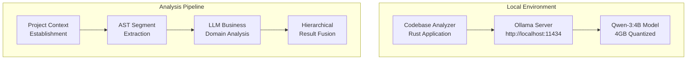

# LLM Integration - Local Ollama Setup and Configuration

## Overview

The Codebase Workflow Analyzer integrates with **Ollama** to provide privacy-preserving local LLM analysis for enhanced business domain classification and semantic code understanding. This integration enables SOTA (State-of-the-Art) hierarchical context-aware analysis while maintaining enterprise-grade security and privacy.

## Architecture Integration



## Model Configuration

### Default Model Selection

**Primary Model**: `qwen3:4b-instruct-2507-q4_K_M`
- **Size**: ~4GB quantized (Q4_K_M)
- **Context Window**: 32K tokens (sufficient for code analysis)
- **Performance**: Optimized for instruction following
- **Languages**: Strong multilingual support including programming languages

**Configuration File**: `configs/data/ollama_config.json`

```json
{
  "default_model": "qwen3:4b-instruct-2507-q4_K_M",
  "server_url": "http://localhost:11434",
  "timeout_seconds": 120,
  "max_retries": 3,
  "recommended_models": [
    {
      "name": "qwen3:4b-instruct-2507-q4_K_M",
      "description": "Balanced performance for code analysis",
      "size_gb": 4.2,
      "context_window": 32768,
      "recommended": true
    },
    {
      "name": "llama3.2:3b-instruct-q4_K_M",
      "description": "Faster inference, smaller context",
      "size_gb": 3.8,
      "context_window": 8192,
      "recommended": false
    }
  ],
  "mcp_permissions": {
    "file_read": "required",
    "file_list": "required",
    "description": "Required for accessing codebase files and project structure"
  }
}
```

## Setup Process

### Automatic Setup via CLI

```bash
# Interactive Ollama setup
cargo run --bin codebase-analyzer setup-ollama

# Analysis with LLM integration
cargo run --bin codebase-analyzer analyze --path /path/to/project --enable-llm
```

### Manual Ollama Installation

**Option 1: Official Installer**
```bash
curl -fsSL https://ollama.com/install.sh | sh
```

**Option 2: Docker Compose**
```yaml
version: '3.8'
services:
  ollama:
    image: ollama/ollama
    ports:
      - "11434:11434"
    volumes:
      - ollama_data:/root/.ollama
    environment:
      - OLLAMA_MODELS=/root/.ollama/models

volumes:
  ollama_data:
```

### Model Download and Validation

The analyzer automatically handles model management:

1. **Model Existence Check**: Verifies if the configured model is available
2. **Download Prompt**: Asks user consent before downloading large models
3. **Disk Space Validation**: Ensures sufficient space (4GB+) before download
4. **Model Validation**: Tests model responsiveness before analysis

```rust
// Automatic model validation example
pub async fn validate_model(&self, model_name: &str) -> Result<bool, OllamaError> {
    let response = self.client
        .post(&format!("{}/api/generate", self.server_url))
        .json(&json!({
            "model": model_name,
            "prompt": "Test prompt",
            "stream": false
        }))
        .send()
        .await?;
        
    Ok(response.status().is_success())
}
```

## LLM Analysis Pipeline

### Business Context Grounding

**Phase**: Step 5 of 6-step analysis pipeline
**Purpose**: LLM-enhanced business domain classification with evidence-based analysis

```rust
pub struct LLMBusinessAnalyzer {
    ollama_manager: OllamaManager,
    prompt_templates: PromptTemplateEngine,
    context_sanitizer: ContentSanitizer,
}

impl LLMBusinessAnalyzer {
    pub async fn analyze_business_context(
        &self,
        project_evidence: &ProjectEvidence,
        code_samples: &[CodeSample]
    ) -> Result<BusinessAnalysis, LLMError> {
        let prompt = self.construct_domain_analysis_prompt(
            project_evidence,
            code_samples
        );
        
        let response = self.ollama_manager
            .generate_analysis(prompt)
            .await?;
            
        self.parse_business_analysis_response(response)
    }
}
```

### Content Preparation and Sanitization

**File Content Reading**: Since standard Ollama installations lack MCP file system access, the analyzer reads and includes relevant file content in prompts:

```rust
fn read_sample_files(&self, project_path: &str) -> Option<String> {
    let mut content = String::new();
    let mut files_read = 0;
    const MAX_FILES: usize = 5;
    const MAX_FILE_SIZE: usize = 2000;
    
    let source_extensions = vec!["rs", "ts", "js", "py", "java", "md"];
    
    // Read representative source files
    for entry in std::fs::read_dir(project_path)? {
        if files_read >= MAX_FILES { break; }
        
        let path = entry.path();
        if let Some(extension) = path.extension().and_then(|e| e.to_str()) {
            if source_extensions.contains(&extension) {
                let file_content = std::fs::read_to_string(&path)?;
                let truncated = if file_content.len() > MAX_FILE_SIZE {
                    format!("{}...[truncated]", &file_content[..MAX_FILE_SIZE])
                } else {
                    file_content
                };
                
                content.push_str(&format!("\n=== {} ===\n{}\n", 
                    path.file_name()?.to_str()?, truncated));
                files_read += 1;
            }
        }
    }
    
    if content.is_empty() { None } else { Some(content) }
}
```

**Content Sanitization**:
- Remove potential API keys and secrets
- Truncate large files to prevent context overflow
- Filter sensitive configuration values
- Validate content before LLM submission

## Domain-Specific Prompting

### Business Domain Classification Prompt

```rust
const BUSINESS_DOMAIN_ANALYSIS_PROMPT: &str = r#"
You are a senior software architect analyzing a codebase to understand its business domain and purpose.

PROJECT CONTEXT:
{project_context}

DETECTED FRAMEWORKS:
{frameworks}

CODE SAMPLES:
{code_samples}

ANALYSIS REQUIREMENTS:
1. Identify the primary business domain (e.g., E-commerce, User Management, Content Management, Analytics, etc.)
2. Describe the core business purpose and value proposition
3. Identify key user personas who would use this system
4. List primary business capabilities and features
5. Assess project maturity and implementation status

RESPONSE FORMAT (JSON):
{
  "primary_business_domain": "specific domain classification",
  "business_description": "clear description of business purpose",
  "user_personas": ["persona1", "persona2"],
  "business_capabilities": ["capability1", "capability2"],
  "project_type": "application type classification",
  "confidence_score": 0.95
}

Focus on business value and user outcomes, not technical implementation details.
"#;
```

### Evidence-Based Analysis

The LLM analysis incorporates multiple evidence sources:

1. **Project Metadata**: package.json, Cargo.toml, requirements.txt
2. **Code Patterns**: API endpoints, data models, business logic
3. **Framework Context**: Detected frameworks and architectural patterns
4. **File Structure**: Directory organization and naming conventions
5. **Documentation**: README files and inline comments

## Performance Optimization

### Non-Interactive Mode

For automated analysis pipelines, the analyzer supports non-interactive mode:

```rust
impl LLMBusinessAnalyzer {
    pub fn new_non_interactive(ollama_config: &OllamaConfig) -> Result<Self, LLMError> {
        let ollama_manager = OllamaManager::new_non_interactive(ollama_config)?;
        
        Ok(Self {
            ollama_manager,
            prompt_templates: PromptTemplateEngine::new(),
            context_sanitizer: ContentSanitizer::new(),
        })
    }
}
```

### Timeout and Retry Configuration

```rust
pub struct OllamaConfig {
    pub timeout_seconds: u64,    // 120 seconds default
    pub max_retries: u32,        // 3 retries default
    pub retry_delay_ms: u64,     // 1000ms exponential backoff
}
```

## Integration with Analysis Pipeline

### Step 5: Business Context Grounding

```rust
// Step 5 implementation in context_aware_framework_detector.rs
let business_analysis = if self.enable_llm {
    println!("  - Starting business context grounding");
    
    let grounding_engine = BusinessContextGroundingEngine::new(&self.llm_config)?;
    let enhanced_analysis = grounding_engine
        .enhance_business_context(&fusion_result, &project_context)
        .await?;
    
    println!("    - Enhanced domain classification completed");
    Some(enhanced_analysis)
} else {
    None
};
```

### Result Integration

LLM analysis results are integrated into the hierarchical fusion process with weighted confidence scoring:

- **Framework Detection** (30%): Traditional pattern-based detection
- **AST Analysis** (40%): Semantic code understanding
- **LLM Enhancement** (30%): Business domain classification

## Error Handling and Fallback

### Graceful Degradation

```rust
pub async fn analyze_with_fallback(&self, evidence: &ProjectEvidence) -> BusinessAnalysis {
    match self.ollama_manager.is_available().await {
        Ok(true) => {
            match self.analyze_business_context(evidence).await {
                Ok(analysis) => analysis,
                Err(e) => {
                    eprintln!("LLM analysis failed: {}, falling back to pattern-based", e);
                    self.fallback_analysis(evidence)
                }
            }
        }
        _ => {
            println!("LLM not available, using pattern-based analysis");
            self.fallback_analysis(evidence)
        }
    }
}
```

### Common Issues and Solutions

**Issue**: Model timeout during analysis
**Solution**: Adjust timeout in config, use non-interactive mode

**Issue**: Insufficient disk space for model download
**Solution**: Automatic disk space check with user notification

**Issue**: Ollama server not running
**Solution**: Automatic server status check with setup guidance

## Security Considerations

### Local Processing Benefits

- **Data Privacy**: All analysis happens locally, no external API calls
- **Enterprise Security**: Suitable for air-gapped environments
- **Content Control**: Full control over data processing and storage
- **Audit Compliance**: Local logging and analysis tracking

### Content Sanitization

- **Secret Detection**: Remove API keys, tokens, passwords from analysis
- **PII Filtering**: Sanitize personally identifiable information
- **Content Validation**: Verify content safety before LLM processing
- **Access Controls**: Restricted file system access patterns

## Future Enhancements

### Advanced Model Support

- **Specialized Models**: Code-specific models for enhanced understanding
- **Multi-Model Ensemble**: Combine multiple models for higher accuracy
- **Fine-Tuning**: Custom model training on domain-specific codebases

### Integration Improvements

- **Streaming Analysis**: Real-time LLM response processing
- **Context Optimization**: Advanced prompt engineering for better results
- **Caching Strategy**: LLM response caching for repeated analysis

---

*This LLM integration provides the foundation for intelligent, privacy-preserving business domain analysis in the Codebase Workflow Analyzer.*